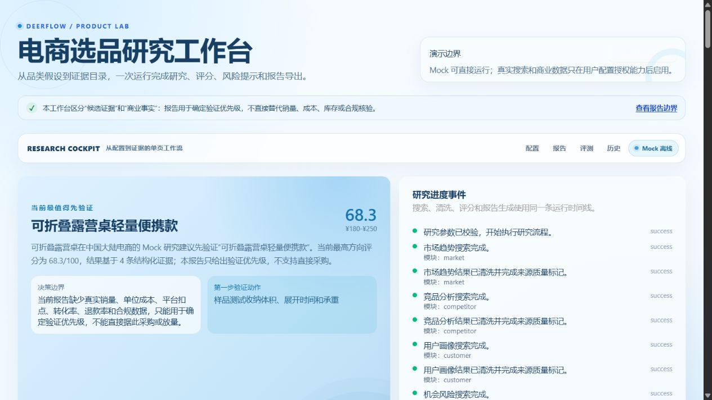
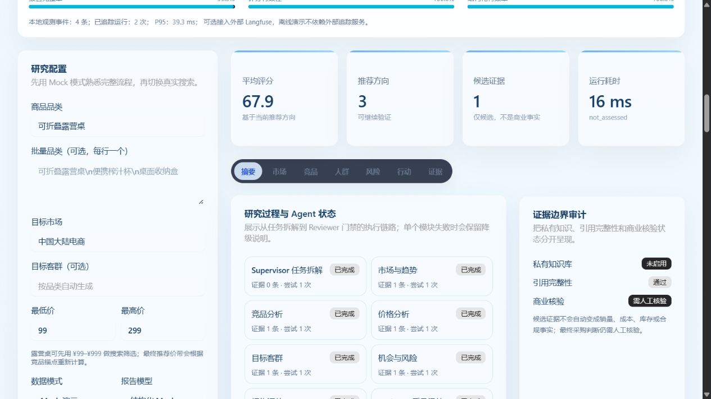
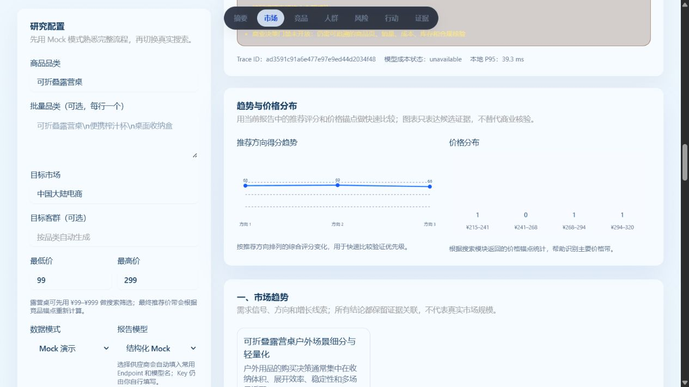
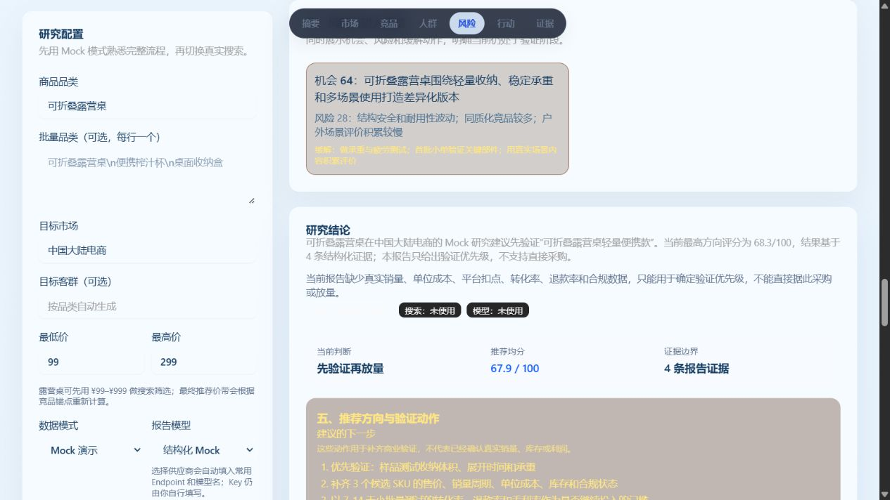

# 选品研判台

选品研判台是一个面向个人卖家和中小商家的电商研究工作台。它把“研究一个品类”整理为可追溯的证据、价格与竞争分析、风险提示和下一步验证动作。

> 当前版本：Demo Final / V1.0。它是可运行、可交互、可复现的演示与验收版本，不等同于真实商业决策系统。

本项目基于 [ByteDance DeerFlow](https://github.com/bytedance/deer-flow) 二次开发，保留上游许可证与归属信息；电商研究台的领域模型、数据适配、报告结构、评测与 Web 交互为本项目扩展。

## 30 秒了解项目

用户输入一个品类和研究约束，系统通过可替换的数据源与模型配置，组织一条可追踪的研究工作流，最后输出“摘要—证据—风险—行动”报告。默认 Mock/Demo 数据让项目无需真实商业 API 即可现场运行；有合法授权的用户可以在 Web 页面配置自己的搜索、商品数据和模型服务。



更多界面截图与演示顺序见 [`docs/GITHUB_SHOWCASE.md`](docs/GITHUB_SHOWCASE.md)。

| 研究流程与 Agent 状态 | 趋势与价格分布 | 风险与验证行动 |
| --- | --- | --- |
|  |  |  |

## 当前能力

- 研究配置：品类、市场、客群、预算、价格区间和研究约束。
- 数据输入：结构化 Mock、本地 Demo Product API、用户自有商品 API、Excel/CSV。
- 模型与搜索：保留 Mock/Live 兼容接口，可由使用者配置 DeepSeek、Tavily 等服务。
- 研究流程：基于 LangGraph 的八节点串行研究流水线：Supervisor、Market、Competitor、Price、Customer、Risk、Report、Reviewer；包含统一结果信封、状态追踪、失败隔离和降级处理。
- 报告输出：摘要、证据、风险、行动四段导航，以及市场、竞品、价格、客群和风险信息。
- 可视化与交付：推荐趋势图、价格分布图、历史回放、对比和 JSON/Markdown/HTML 导出。
- 工程化：Docker Compose、快捷启动脚本、能力预检、质量门禁和自动化测试。

## 重要技术边界

当前默认路径是“确定性 Mock / Demo 数据 + 可选模型增强”，不是由 LLM 动态路由的多智能体系统。八个节点的工程价值在于模块化、失败隔离、状态可观测和后续接入真实模型；当前不能把它表述为已经实现了 LLM 驱动的 Supervisor 路由或真实多智能体协作。

同样，离线评测默认使用确定性规则 Judge；LLM Judge 已实现适配接口，只有在使用者配置真实模型后才运行真实模型评分。Mock 的延迟、成本和 Token 数据只用于验证流程，不代表真实 LLM 性能。

Demo Product API 返回固定的 `DEMO_ONLY` 样品，不代表真实销量、库存、排名、价格或利润。真实商品信息必须来自使用者有合法权限的 API、Reader 服务或自有 Excel/CSV 文件。

## 快速演示

Windows 下在项目根目录双击：

```text
start_ecommerce_mock.bat
```

然后打开：

```text
http://127.0.0.1:3000/ecommerce
```

推荐路径：选择本地 Demo Product API → 启用并预检 → 载入样品 → 点击“一键体验 Mock” → 按“摘要—证据—风险—行动”查看报告。

不需要真实 DeepSeek、Tavily 或商品 API Key。完整演示话术见 [`docs/FINAL_DEMO_RUNBOOK_2026-08-18.md`](docs/FINAL_DEMO_RUNBOOK_2026-08-18.md)。

## 公开演示边界

- Demo Product API 只返回固定的 `DEMO_ONLY` 样品，不能代表真实销量、库存、排名、价格或利润。
- 真实商品信息必须来自使用者有合法权限的 API、Reader 服务或自有 Excel/CSV 文件。
- 没有真实 API 时，Live 指标、真实成本和商业结论均标记为未完成，不用 Mock 数据冒充真实线上效果。
- 项目只用于产品能力展示、工程验收和研究流程验证；不保证销售结果，也不构成投资或经营建议。

## Docker 启动

```powershell
docker compose -f docker-compose.demo.yml up --build
```

也可以使用：

```text
start_ecommerce_docker.bat
```

部署说明见 [`docs/ecommerce-deployment.md`](docs/ecommerce-deployment.md)。

## 测试

项目测试使用 `pytest`，电商模块测试可以按以下方式运行：

```powershell
pytest -q tests/unit/ecommerce tests/unit/evaluation
```

完整验收材料和评测结果见：

- [`docs/FINAL_PRODUCT_REQUIREMENTS_2026-08-18.md`](docs/FINAL_PRODUCT_REQUIREMENTS_2026-08-18.md)
- [`docs/FINAL_PRODUCT_SPEC_2026-08-18.md`](docs/FINAL_PRODUCT_SPEC_2026-08-18.md)
- [`docs/ecommerce_schema.md`](docs/ecommerce_schema.md)
- [`docs/evaluation_spec.md`](docs/evaluation_spec.md)
- [`docs/USER_OPERATION_MANUAL.md`](docs/USER_OPERATION_MANUAL.md)

## 评测口径

项目采用双轨评测：

1. 离线轨：使用 Mock 验证 schema、报告完整性、失败降级和可复现性。
2. Live 轨：使用者配置自有模型、搜索和商品 API 后，才记录真实延迟、Token、成本和模型质量。

没有真实 API 时，Live 指标必须标记为未完成，不使用 Mock 数据冒充真实模型指标。

## 目录说明

```text
src/ecommerce/       电商领域模型、数据源、研究流程和报告逻辑
src/evaluation/      当前电商评测集、规则 Judge 和消融实验
src/eval/             通用评测兼容层，历史接口暂保留
web/                  Web 交互页面
tests/                单元、集成和回归测试
data/evaluation/      50 条电商评测集
artifacts/            精选评测产物（本地运行数据库与临时产物不提交）
docs/                 最终说明、部署、演示、交接和评测文档
```

## 可选后续扩展

- 在合法授权数据条件下建立真实模式延迟、成本和质量基线。
- 在用户提供真实模型后运行 LLM Judge，并继续校准人工评分与模型评分的差异。
- 根据真实 embedding 的结果重新评估 Rerank 是否值得保留。
- 在不改变 Demo 默认可运行性的前提下，扩展多用户、权限和生产级密钥托管。

## 许可证

本项目基于 DeerFlow 二次开发，许可证见 [`LICENSE`](LICENSE)。

